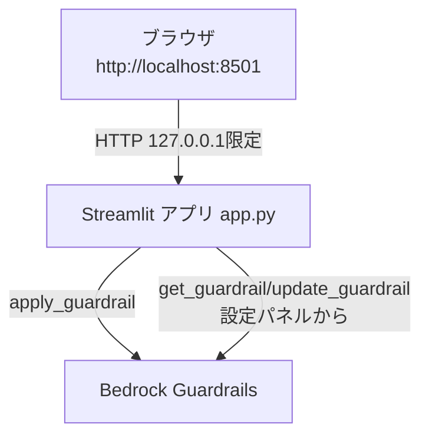

# Prompt Masking Tool 開発記録

最終更新: 2026-08-18
リポジトリ: https://github.com/Martim500/MaskAI

---

## 1. 概要

生成AI（ChatGPT等）にプロンプトを入力する前に、個人情報や会社名などを自動でマスキングするための社内ツール。
**AIとの会話機能は持たず**、「テキストを入力 → PIIをマスキング → 結果を表示・コピー」だけを行う。
マスキング処理には Amazon Bedrock Guardrails を使い、Streamlit製のシンプルなWebアプリとして実装した。

### できること
- テキストを貼り付けて「マスキングする」ボタンを押すと、以下をマスキングして表示する
  - 氏名、メールアドレス、電話番号、住所、年齢、クレジットカード番号（Bedrock Guardrails標準のPII検知）
  - 会社名（株式会社ファンリード／ファンリード／Funlead／funlead／FL社／(FL) など、カスタム正規表現で個別登録したもの）
- マスキング後のテキストはワンクリックでコピーでき、他のAIチャットに貼り付けて使う想定
- マスキング対象の追加・削除は画面上の「Guardrail設定」パネルから、プログラミング知識無しで変更できる
- AWS認証情報は`.env`ファイルのみで管理し、画面には一切表示されない
- ローカルPC上でのみ動作し（`127.0.0.1`限定）、外部やLANからはアクセスできない

### できないこと・やらなかったこと
- AIとの会話（Claudeへの送信）はしない。当初はBedrock Claudeとの会話機能まで作ったが、要件確認の結果「マスキングだけでよい」と分かり撤去した（詳細は後述）
- 複数人でのログイン管理・利用履歴の保存は無い（一度作ったが、要件変更に伴い撤去）
- 「未公開決算情報」「契約書の内容」のような、パターンでは検知できない意味的な情報の検知はしていない（Bedrock GuardrailsのDenied Topics機能を使えば理論上は可能だが未着手）

---

## 2. 開発の経緯（なぜこの形になったか）

### 2-1. 当初の想定: Anthropic直接APIを使うチャットアプリ
最初に見つけた既存コードは、Bedrock Guardrailsでマスキング → Anthropic API（api.anthropic.com）へ送信、という構成のチャットアプリだった。

### 2-2. Bedrock Claudeへの一本化
「Anthropic APIを使うより、AWSアカウントに一本化した方が管理・課金面で楽」という判断から、会話部分もAmazon Bedrock経由のClaude（Converse API）に切り替えた。

### 2-3. AWS認証まわりの想定外のつまずき
ここで複数の想定外の壁にぶつかった（詳細は「3. 発生したエラーと対応」参照）。
- メインのIAMユーザーの認証情報が失効していた
- 生きている認証情報も、MFA必須ポリシーにより実質何もできなかった
- 専用のIAMユーザーを新規作成したが、細かい権限が段階的に不足していることが分かり、都度追加した

### 2-4. 要件の大きな転換
ある程度チャット機能・複数セッション管理・簡易ログイン・DynamoDBでの永続化まで作り込んだ後、
「マスキング済みのテキストをChatGPT等の別のAIサービスに手動で貼り付けて使う」という運用が実態であり、
**そもそもAIとの会話機能は要らない**ということが判明した。この時点でチャット・ログイン・セッション管理・
DB連携のコードを全て削除し、「マスキングして表示するだけ」のシンプルな構成に作り直した。

> 教訓: 最初に「何を作るか」を明確にしないまま作り始めると、後戻りのコストが大きくなる。
> 特にAI系のツールは「会話させたい」のか「前処理・後処理だけしたい」のかで設計が全く変わる。

### 2-5. 配布方法の検討
「各自のPCで動かす」運用にするにあたり、Python環境構築の手間を減らすためDocker化を行った
（Docker Desktopの起動確認までで、実機ビルドは未完了）。

---

## 3. 発生したエラーと対応

開発中に発生した問題を時系列で並べる。特にAWS Bedrock Guardrails周りは、ドキュメントだけでは分からない
実装の癖が複数あり、実機検証で初めて判明したものが多かった。

### 3-1. AWS認証情報が無効（`InvalidClientTokenId`）
`~/.aws/credentials`に設定されていたメインIAMユーザーの認証情報が失効していた。
→ 新しいアクセスキーを発行し直して解決。

### 3-2. MFA必須ポリシーによる全操作拒否
新しいキーでも `AccessDeniedException...explicit deny in an identity-based policy: BlockNonMFARequests` が発生。
アカウントに「MFA認証が無いリクエストは拒否する」というポリシーが付いており、Bedrockを含むほぼ全操作が実行不可だった。
→ アプリ専用の新規IAMユーザー（`REDACTED_IAM_USER`）を作成し、このポリシーの対象外にすることで解決。
常時稼働するアプリが人間のMFA操作を要求されるのは運用上成立しないため、専用ユーザーの分離は必須だった。

### 3-3. 権限不足の段階的な発覚
新規ユーザーに対し `iam simulate-principal-policy` で検証しながら、以下を都度追加した。
- `bedrock:ApplyGuardrail`（マスキング処理そのもの）
- `bedrock:CreateGuardrail` / `CreateGuardrailVersion` / `UpdateGuardrail`（Guardrail管理）

途中、`bedrock:Converse` という権限も追加が必要かと思い込んだが、AWS公式ドキュメントを調査した結果、
**Converse APIの権限は`bedrock:InvokeModel`で既にカバーされており、別途`bedrock:Converse`は不要**と判明。
（この`Converse`アクションは主に明示的なDeny用に用意されたもので、Allow文に含める必要は無い）

### 3-4. Guardrailを作ったのにINPUT側でマスキングされない
`create_guardrail`でPII種別を設定しGuardrailを作成したが、`ApplyGuardrail`を`source=INPUT`で呼んでも
一切マスキングされない（`action: NONE`が返る）という現象が発生。`source=OUTPUT`だと正常に動作した。

原因調査の結果、Bedrock GuardrailsのPII設定には`action`という古い/簡易フィールドとは別に、
**`inputAction` / `inputEnabled` / `outputAction` / `outputEnabled`という入出力を個別制御するフィールドがあり、
これを明示しないと入力側（INPUT）のマスキングがデフォルトで無効になる**という仕様だった。
AWS公式ドキュメントにも明記が薄く、実際にAPIレスポンスを検証して初めて気づいた。

```python
# NG: inputAction/inputEnabledを指定しないと source=INPUT で機能しない
{"type": "EMAIL", "action": "ANONYMIZE"}

# OK
{
    "type": "EMAIL",
    "action": "ANONYMIZE",
    "inputAction": "ANONYMIZE",
    "inputEnabled": True,
    "outputAction": "ANONYMIZE",
    "outputEnabled": True,
}
```

### 3-5. モデル呼び出しでMarketplaceのエラー
Bedrock Claudeを呼び出そうとすると
`AccessDeniedException: ... not authorized to perform the required AWS Marketplace actions (aws-marketplace:ViewSubscriptions, aws-marketplace:Subscribe)`
というエラーが発生。Bedrock上のAnthropicモデルは初回利用時にAWS Marketplace経由の自動サブスクライブが走る仕様で、
そのための権限が無かった。
→ 該当2アクションを、`aws:CalledViaLast: bedrock.amazonaws.com`という条件（Bedrock経由の呼び出し限定）付きで追加し解決。
（この権限は最終的にAI会話機能ごと削除したため、今は使っていない）

### 3-6. `ValidationException`: オンデマンド呼び出し不可
`anthropic.claude-sonnet-5`のような生のfoundation-model IDを指定すると
`Invocation of model ID ... with on-demand throughput isn't supported. Retry your request with the ID or ARN of an inference profile`
というエラー。オンデマンド呼び出しには生のモデルIDではなく**推論プロファイルID**（`jp.anthropic.claude-opus-4-8`等）
を指定する必要があった。`aws bedrock list-inference-profiles`で確認して解決。

### 3-7. `KeyError: 'text'`
Claude（特にSonnet 5の拡張思考）が、指定した`maxTokens`の上限に達するまで「思考(reasoning)」だけを続け、
実際の回答テキスト（`text`ブロック）が1つも無いレスポンスを返すことがあった。
```
response["output"]["message"]["content"][0]["text"]  # ここでKeyError
```
→ `content`配列から`text`キーを持つブロックだけを安全に抽出する処理に変更し、`maxTokens`も引き上げて対応。
（この機能自体は後にAI会話機能ごと削除）

### 3-8. カスタム正規表現「FL」の誤検知
会社名の略称として「FL」を単体でマスキング対象にしようとしたところ、実機検証で以下が判明。
- `\bFL\b`（単語境界付き）は、日本語がそのまま隣接する「FLの担当者」「FL社に確認」のような
  実際にありそうな文で**全くマッチしない**（Pythonの正規表現は日本語も「単語文字」とみなすため、
  英字と日本語の間に境界が生まれない）
- 境界無しの`FL`は「FLIGHT」「1FLの会議室」のような無関係な文字列まで誤ってマスキングしてしまう

→ 「FL社」「(FL)」「（FL）」など、会社名だと明確に分かる文脈のみにパターンを限定して解決。

### 3-9. DynamoDBの`ResourceNotFoundException`（要件変更前の名残）
セッション永続化にDynamoDBを使う設計にしていた際、テーブル作成を後回しにした状態でアプリを動かすと
`Query operation: Requested resource not found`が発生。実際にテーブルが存在しないだけの想定内挙動だったが、
「エラーが出るのに動作は継続する」という分かりにくい状態だった。
→ 最終的にDynamoDB連携自体を撤去したため、この問題は解消。

### 3-10. StreamlitでCtrl+Cを押すとキャッシュクリアの確認が出る
テキストをコピーしようとCtrl+Cを押すと、Streamlitの「キャッシュをクリアしますか？」という確認ダイアログが出る現象。
原因は、Streamlitがlocalhostでの実行を「開発中」とみなし、`c`キー＝キャッシュクリア、`r`キー＝再実行、という
開発者向けキーボードショートカットを有効化していたため。**Ctrl+Cの「C」部分だけを拾って**反応していた。
→ `.streamlit/config.toml`に`[client] toolbarMode = "minimal"`を追加し、開発者向けツールバー・ショートカットを無効化して解決。

### 3-11. 日本語ファイル名のバッチファイルが実行できない
起動用バッチファイルを`起動.bat`という名前で作成したところ、`cmd /c "起動.bat"`のような呼び出しで
`'起動.bat' is not recognized as an internal or external command`というエラー。
ファイル名をASCIIの`start.bat`に変更しても、今度は`'start.bat' is not recognized`という別のエラーが発生。
これは`start`がcmd.exeの組み込みコマンド名と衝突していたためで、`.\start.bat`のように相対パスを明示することで解決。
またバッチファイル内の日本語テキスト（echoメッセージ）も、環境によって文字コード解釈が崩れる事例が
複数回発生したため、最終的には**バッチファイルの中身・ファイル名は全てASCII文字のみ**で統一した。

### 3-12. PowerShellコマンドをバッチファイルに埋め込むと引用符が壊れる
停止用バッチファイル内に`powershell -Command "..."`という形でPowerShellのワンライナーを埋め込んだところ、
コマンドの一部（"hell"のような断片）が別コマンドとして誤認識されるという不可解なエラーが発生。
→ PowerShell側のロジックは`stop.ps1`という別ファイルに切り出し、バッチファイルからは
`powershell -File "stop.ps1"`という単純な呼び出しだけにすることで解決。バッチファイル内での
複雑な引用符のネストは避けるべき、という教訓。

### 3-13. `st.toast()`の通知が一瞬で消えて見えない
Guardrail設定を保存した際に完了通知を出そうとして`st.toast(...)`の直後に`st.rerun()`を呼んだところ、
再実行のタイミングと重なって通知が全く見えないという報告があった。
→ `st.toast`に頼らず、`st.session_state`にフラグを立てて`st.rerun()`し、**次の描画の冒頭で**
`st.success(...)`を表示する方式に変更。一時的な通知の見た目より確実性を優先した。

---

## 4. 最終的な構成



- **フロント/バックエンド一体**: Streamlit製の単一Pythonスクリプト（`app.py`）
- **マスキング処理**: Amazon Bedrock Guardrails（`ApplyGuardrail` API）
- **設定管理**: 画面上の「⚙️ Guardrail設定」パネルからPII種別・カスタム正規表現を編集し、
  `UpdateGuardrail` APIでその場でAWS側に反映
- **認証情報**: `.env`ファイルのみ（画面には非表示）
- **配布方法**: Dockerコンテナ化を進行中（Docker Desktopインストールのみを前提に、
  バッチファイルのダブルクリックで起動・ブラウザが自動で開く体験を目指した）

### 使用しているAWSリソース
| リソース | 値 |
|---|---|
| Bedrock Guardrail ID | `REDACTED_GUARDRAIL_ID` |
| マスキング対象PII | 氏名・メールアドレス・電話番号・住所・年齢・クレジットカード番号 |
| カスタム正規表現 | 株式会社ファンリード／ファンリード／Funlead／funlead／FL社／(FL) |
| IAMユーザー | `REDACTED_IAM_USER`（アプリ専用、`bedrock:ApplyGuardrail`等の最小権限） |

---

## 5. 使い方

### セットアップ（初回のみ）
1. `pip install -r requirements.txt`
2. `.env.example`を`.env`にコピーし、AWS認証情報とGuardrail ID/Versionを設定
   ```
   AWS_REGION=ap-northeast-1
   AWS_ACCESS_KEY_ID=xxxx
   AWS_SECRET_ACCESS_KEY=xxxx
   GUARDRAIL_ID=REDACTED_GUARDRAIL_ID
   GUARDRAIL_VERSION=DRAFT
   ```

### 起動・停止
- 起動: `start.bat`をダブルクリック（ブラウザが自動で開く。開かない場合は`http://localhost:8501`）
- 停止: 起動時に開いたウィンドウで`Ctrl+C`、または`stop.bat`をダブルクリック

### マスキングの実行
1. テキスト入力欄にマスキングしたい文章を貼り付ける
2. 「マスキングする」ボタンを押す
3. マスキング後のテキストが表示される（右上のアイコンでワンクリックコピー）
4. コピーしたテキストを、使いたいAIチャット（ChatGPT等）に貼り付けて利用する

### マスキング対象の追加・変更
1. 画面上部の「⚙️ Guardrail設定」を開く
2. PII種別（氏名・メール・電話番号など）のチェックボックスをON/OFF
3. 「カスタム正規表現」の表に、追加したい会社名や固有名詞のパターンを行として追加
4. 「この内容でGuardrailを保存」を押すと、その場でAWS側に反映される

---

## 6. 今後の課題

- **なりすまし対策**: 現状ログイン機能自体を撤去したため「誰でもGuardrail設定を変更できる」状態。
  変更履歴を残したい・編集権限を絞りたい場合は、簡易ログイン＋管理者制限の再導入が必要
- **意味的な検知（Denied Topics）**: 「未公開決算情報」「契約書の内容」等、正規表現では検知できない
  情報分類は未対応。`docs/業務領域・ユースケースごとのデータ入力可否.xlsx`を元にした設計が必要
- **Docker配布の完成**: Dockerfile・起動スクリプトは作成済みだが、実機でのビルド・動作確認は未完了
  （Docker Desktopの起動待ちで中断）
- **会社名マスキングの網羅性**: 現状は登録した固有名詞のみが対象で、未知の会社名は検知できない
  （Bedrock Guardrails標準機能に組織名の自動検知は無いため）
